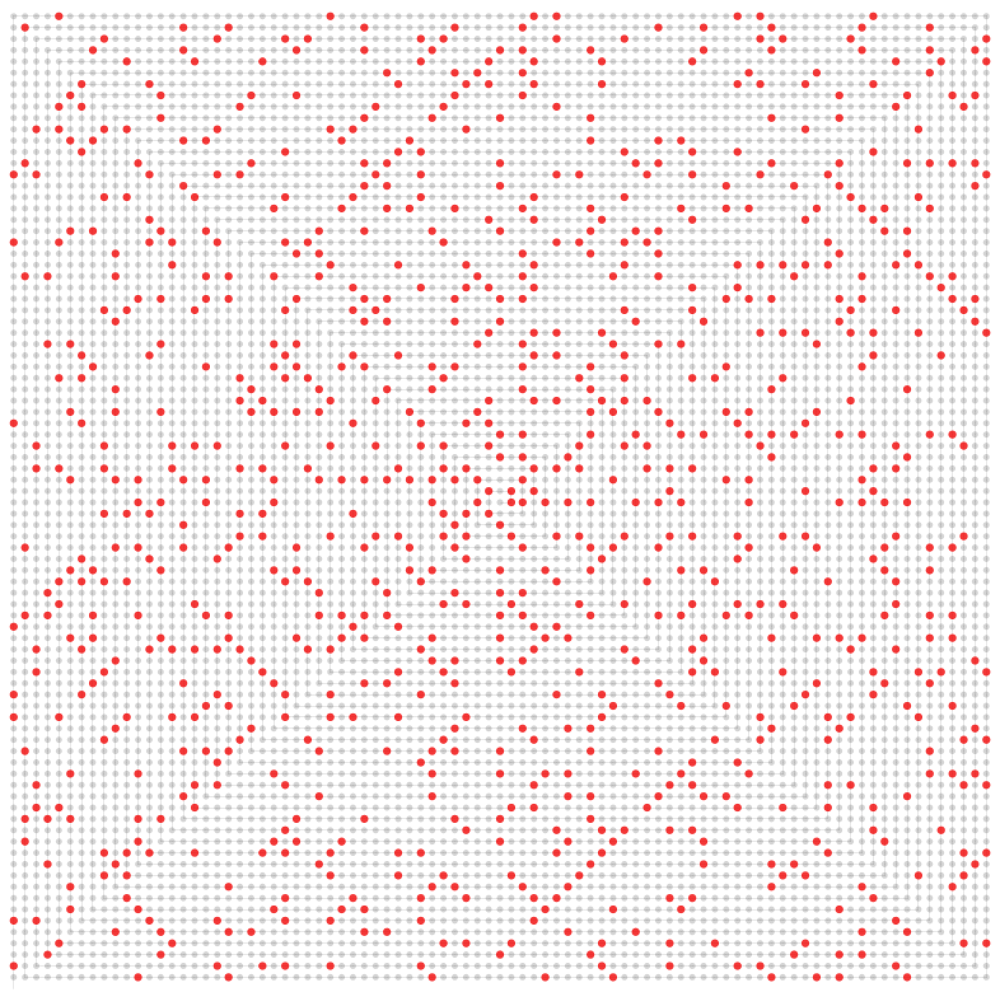

Primers Modulator
=================

After creating a simple script for generating an endless list of prime numbers, I tried to visualize them in a way that could reveal something interesting.
 
The first thing I tried to do was to put them in a archimedean spiral (r = a + b × t). Then I learned that Stanislaw Ulam, in 1963, came up with a simple yet revealing arrangement for prime numbers (Ulam's rose). He created a gridded square spiral that presented mysterious diagonal patterns that still remain unexplained.

 
From this starting point, I'm trying to design a tool for discovering the hidden patterns in the prime numbers.  If you play long enough, maybe you can find a hidden pattern that explains the aparent randomness of primes. Good luck!

Claim your prize at mathword.com, but remember to take your PDFs as a proof of your discovery. You'll need to run executable version in order to get a PDF.

~ Originally Dec 2006